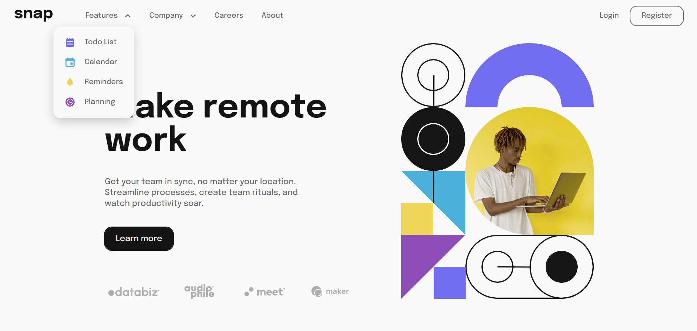

# Frontend Mentor - Intro section with dropdown navigation solution

This is a solution to the [Intro section with dropdown navigation challenge on Frontend Mentor](https://www.frontendmentor.io/challenges/intro-section-with-dropdown-navigation-ryaPetHE5). Frontend Mentor challenges help you improve your coding skills by building realistic projects. 

## Table of contents

- [Overview](#overview)
  - [The challenge](#the-challenge)
  - [Screenshot](#screenshot)
  - [Links](#links)
- [My process](#my-process)
  - [Built with](#built-with)
  - [What I learned](#what-i-learned)
  - [Continued development](#continued-development)
- [Author](#author)
- [Acknowledgments](#acknowledgments)

## Overview

### The challenge

Users should be able to:

- View the relevant dropdown menus on desktop and mobile when interacting with the navigation links
- View the optimal layout for the content depending on their device's screen size
- See hover states for all interactive elements on the page

### Screenshot



**It's ✨animated✨**

### Links

- Solution URL: [https://github.com/Emvil-git/fe-mentor_intro-section-with-dropdown-navigation](https://github.com/Emvil-git/fe-mentor_intro-section-with-dropdown-navigation)
- Live Site URL: [https://fe-mentor-intro-section-with-dropdown-navigation.vercel.app/](https://fe-mentor-intro-section-with-dropdown-navigation.vercel.app/)

### Built with

- Flexbox
- CSS Grid
- Mobile-first workflow
- [React](https://reactjs.org/) - JS library
- [Sass](https://sass-lang.com/) - For styles
- [BEM](https://getbem.com/) 

**I use a custom BEM hook to make naming classes cleaner**

Here's how it looks like in Javascript..

```js
    const [B,E] = useBEM('nav-desktop')

    return(
        <div className={B()}>
            
        </div>
    )
```

Here's how I would style it in CSS
```css
.nav-desktop{
    /* Some styling for the block */

    &__logo{
        /* Some styling for the element */

        &--zoom{
            /* Some styling if I have any modifiers */
        }
    }
}
```

### What I learned

The highlight of this project to me was coding the animations for the mobile navbar menu and the 
dropdown menus. I couldn't make attr() work in css but I found a way to make it work.

This is how I handled the state of the sliding menu:

```js
const [slideDatThang, setSlideDatThang] = useState(null) 

const openMenu = () => {
    switch(slideDatThang){
        case 'open':
            return E('menu', 'open')
        case 'close':
            return E('menu', 'close')
        default:
            return E('menu')
    }
}

const openMenuCont = () => {
    switch(slideDatThang){
        case 'open':
            return E('menu-cont', 'open')
        case 'close':
            return E('menu-cont', 'close')
        default:
            return E('menu-cont')
    }
}
```
And example of how I do the styling (This is the "darkening" container for the sliding menu)

```css
...
    &__menu{ // This is where I would put the initial close state styling
        position: absolute;
        top: 0;
        left: 0;
        bottom: 0;
        height: 100vh;
        width: 100vw;
        background-color: $black50;
        z-index: 3;

        display: flex;
        justify-content: flex-end;

        opacity: 0;
        display: none;

        overflow: hidden; 

        &--open{ 
            opacity: 0; // The opacity would be filled out by the end of the animation...
            display: flex !important;
            animation: materialize 0.2s ease-in 1 forwards;
        }

        &--close{
            opacity: 1; // Same here but the opposite would happen as the menu is closed..
            display: flex !important;
            animation: dematerialize 0.2s ease-in 0.3s 1 forwards;
        }
    }
```

The pattern is basically the same for the dropdown menus, with three states - initial, open, and closing.

The reason for this is because I don't want to see the closing animation play out as it would if I had done only two states - open and closed.

### Continued development

From what I've learned here, I want to do more dynamic animations in future projects. Animations can
be meticulous and a bit time-crunchy for me to implement in React but I've heard of some tools that can
help with that such as GSAP that I'm excited to try in future projects.

Besides that, I also want to learn more about keeping my code clean as I'm not exactly satisfied with
how "messy" I've handled the animation states - too many functions in my opinion.

## Author

- Website - [Emvil-git](https://www.your-site.com)
- Frontend Mentor - [@Emvil-git](https://www.frontendmentor.io/profile/Emvil-git)

## Acknowledgments

I would like to thank [The 1975](https://open.spotify.com/artist/3mIj9lX2MWuHmhNCA7LSCW?si=hm5NPkZqT92fJ3hr_a7qGw) for providing the jams while I was working on this project. Pretty fun stuff.

